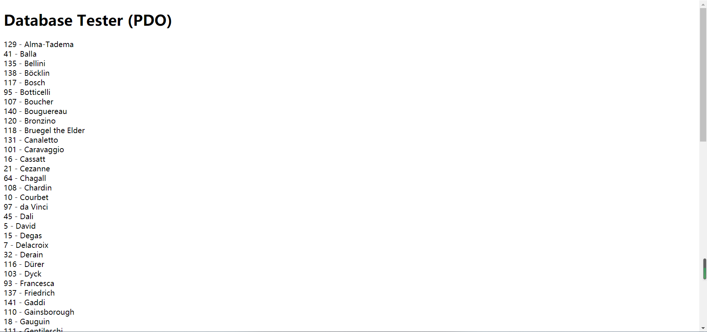

* Lab10 文档  
  
** exercise7 中的代码解释  
1、lab10-exercise7-pdo.php中的代码  
try{}catch()块进行异常处理，重点关注try块中进行的操作。  
第一行声明了一个变量 : $pdo = new PDO(DBCONNSTRING,DBUSER,DBPASS);  这是调用统一的php数据对象接口进行数据库访问。  
紧随其后第二行进行了关于错误报告的属性设置，这与之前的try-catch异常处理方式相关。  
第三行又是一个变量声明，这次赋给$sql的初始值为一个字符串。  
第四行调用了$pdo对象的query方法，参数为$sql，这里就相当于之前在phpMyAdmin中SQL输入框中输入字符串并执行，此处为代码层面，之前为用户界面层面。  
之后的while循环，则是遍历查找结果并在每一行输出相应的ArtistID和LastName。  
细节：在遍历完成后执行$pdo=null;相当于java中的关闭文件流，预防错误调用，是优秀的代码习惯。  
    
  
  
2、lab10-exercise7-mysqli.php中的代码  
首先打开一个到MySQL服务器的连接并验证是否打开成功。  
之后与上面相似，将字符串赋值给$sql变量并传给对应的query函数。  
此处使用的mysqli_query($connect,$sql)与之前不同的点在于：之前的数据库是作为PDO，所以调用的时候不需要传入指定数据库的参数，而此处的函数并不属于某个特定对象，所以需要传参的时候传入连接。在while函数中同样是遍历查找结果并加入select的子标签<option>中。  
良好的代码习惯：     
// release the memory used by the result set  
     mysqli_free_result($result);   
释放内存保证系统正常运行。  
 // close the database connection  
   mysqli_close($connection);  
及时关闭连接防止错误调用。  
  
  
** exercise8 中的代码解释  
  
outputArtists()  
通过PDO模式得到数据库的对象，将LastName设置成超链接，href属性中通过$_SERVER["SCRIPT_NAME"]统一路径，并通过id= $row['ArtistID']来区分各个artist的页面（为之后展示paintings做铺垫）  
在展示artists列表的时候进行了$_GET['id'] == $row['ArtistID']判断，若为真则修改class属性，从而实现了样式变化。  
outputPaintings()  
亮点在于select * from Paintings where ArtistId=' . $_GET['id']  
筛选出了页面中对应的artist的作品，这就体现了之前超链接中设置id的重要性。  
outputSinglePainting($row)  
辅助函数，承担了outputPaintings()中最核心的功能部分。本身主要是构建html内容，亮点在于图片寻址中采用传入的$row参数，从而得到$row['ImageFileName']的值，达到调用不同的图片的目的。  
  
** exercise9 总结php中执行SQL语句的方法  
1、exec(string statement) 参数为sql语句，返回值为执行SQL语句时受影响的行数。常用于 INSERT，DELETE和UPDATE语句中。  
2、query(string statement) 参数为sql语句，返回值是一个PODStatement对象。  
  
query和exec都可以执行所有的sql语句，只是返回值不同而已。query可以实现exec所有的功能。  
  
3、预处理语句：prepare()语句和execute()语句。  
即exercise9中所使用的方法。首先，通过prepare()方法做查询准备工作，然后通过execute()方法执行查询，并且还可以通过bindParam()方法来绑定参数给execute()方法。  
预处理的优点：  
查询只需要被解析（或准备）一次，可以使用相同或不同的参数执行多次。如果要重复执行许多次有不同参数的但结构相同的查询，通过使用一个预处理语句你就可以避免重复分析、编译、优化的环节。简单来说，预处理语句使用更少的资源，执行速度也就更快。