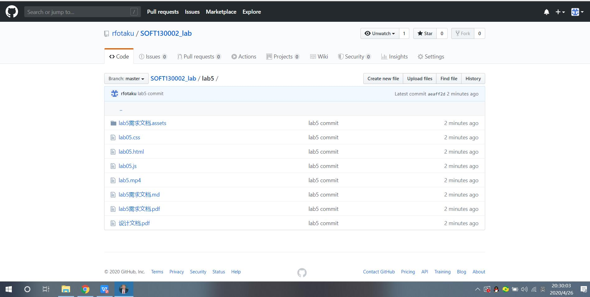
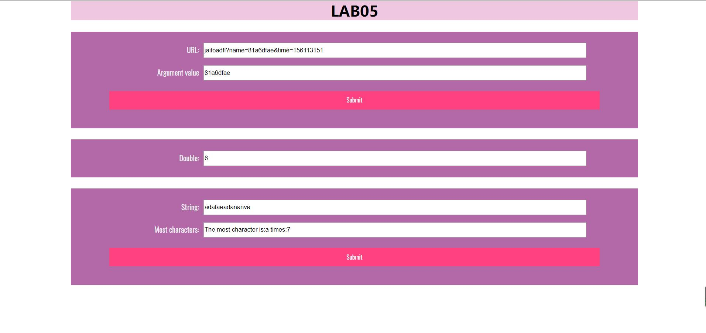

# Lab5 设计文档  

## URL中name参数的提取  
主要是对字符串的分割处理。用到了split(seperator,how many)函数，这个函数有两个参数，其中第一个为必填参数，确定分割点，第二个为最大分割个数，选填。本次我选择仅使用第一个参数。首先使用split(“?”)得到url中?后面的参数列表，然后使用split(“&”)得到各个参数的键值对，最后通过split(“=”)一一考察，找到name对应的值。  
  
## 条件循环double  
首先使用addEventListener来添加触发循环的方式，这次我选用了mouseover。之后通过setInterval的使用，第一个参数填入我需要执行的函数（即value乘2），第二个参数填入时间间隔5000ms。因为加入特殊的终止条件，在函数中添加了run_times变量来统计运行次数。添加了now变量来确认当次运行的秒数是否为0。  
  
## 字符串中出现次数最多的字符    
通过most.value得到字符串之后，遍历字符串。将每一位字符对应存入count对象中，如果不存在就存入，初始次数计为1；如果存在就+1。之后在count中找到max以及对应的Index即可  
  
  
## 截图  
  
  
  
