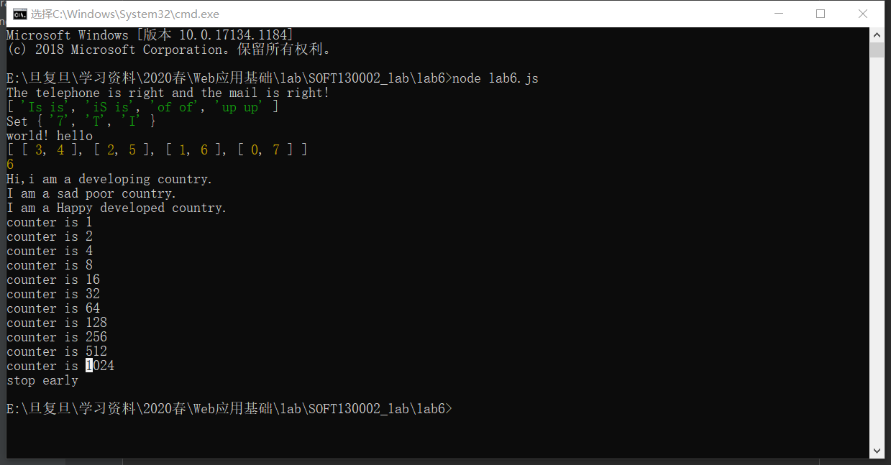

# Lab6实验设计文档  
  
## 第一题，函数闭包。  
根据Lab5中已使用的setInterval实现5s重复执行函数。另外修改counter，使计数器封装入一个返回函数的函数中，从而达到私有化，只能通过double()来修改counter的值。  
  
## 第二题，正则匹配。  
使用reg.test(str)来进行匹配。其中邮箱的正则表达式我选择了/^\w+@\w+(.\w+)*$/，这是以username@xxx.xxxx.xxxx……这样的模式来设计的。  
## 第三题，正则匹配重复单词。  
正则表达式为/(\b\w+\b)(\s\1)/igm,其中\b是用于匹配单词边界，\1是用于匹配重复单词。后缀i不区分大小写，g不在第一次匹配停下，m匹配多行。用sort方法进行字典排序，如果length大于十，则length = 10，将后面的舍去。  
  
## 第四题，set的使用。  
将want和actual分别存入两个set中，然后从want中删去actual中存在的元素，即可得到“坏掉”的键位。由于大小写敏感，所以在存入set前将字符串用toUpperCase（）函数进行转化。  
  
##  第五题，array的使用。  
通过array.reverse可以轻松实现反转，因此难点在于对字符串的空格处理。先处理两端的空格，replace(/(^\s*)|(\s*$)/g, "")，将两端的空格消除。再将中间的空格缩为一个replace(/\s{2,}/," ")。处理好字符串后，split、reverse、join即可借助array实现字符串反转。  
  
## 第六题，map的使用。  
遍历数组，将差值作为key，下标作为value，先查找key-value对是否存在，若存在则取出value，与当前下标成对存入结果数组中；否则将key-value对存入map中。  
  
  
